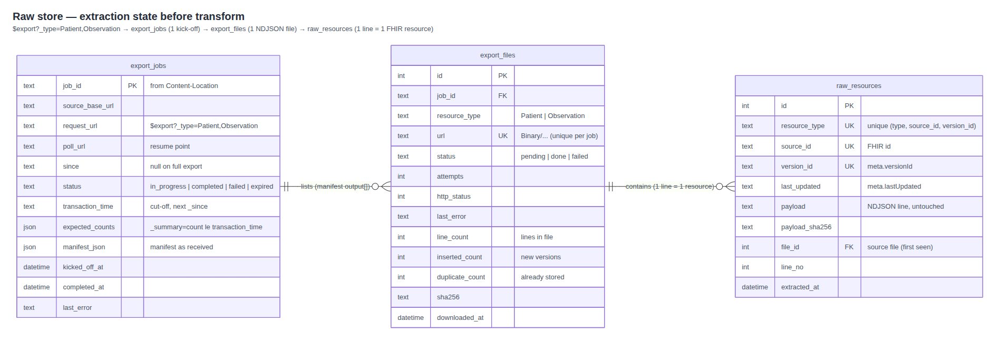
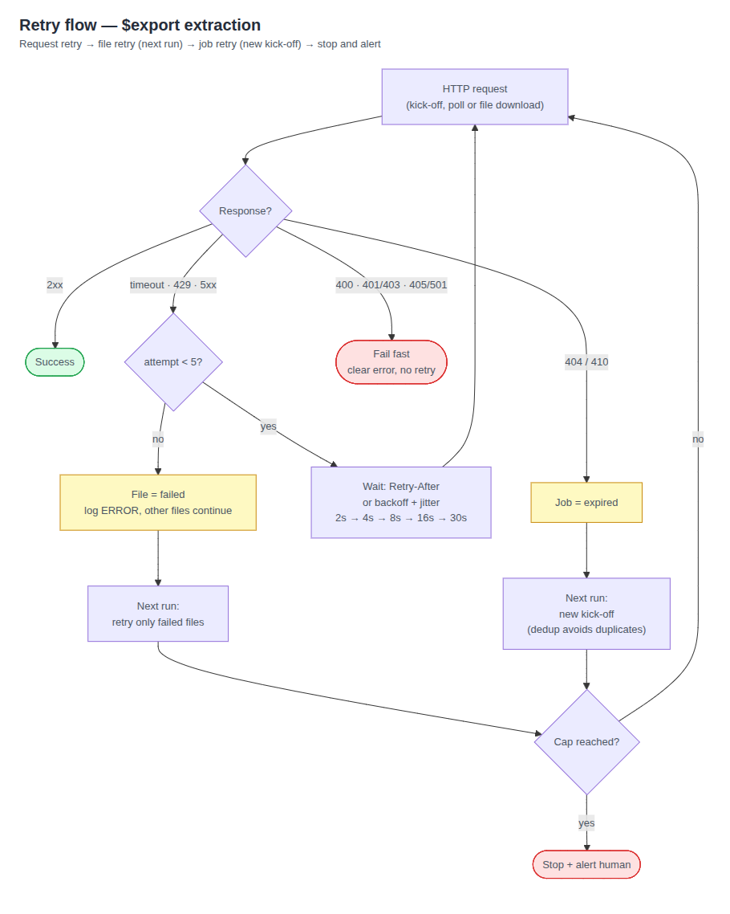
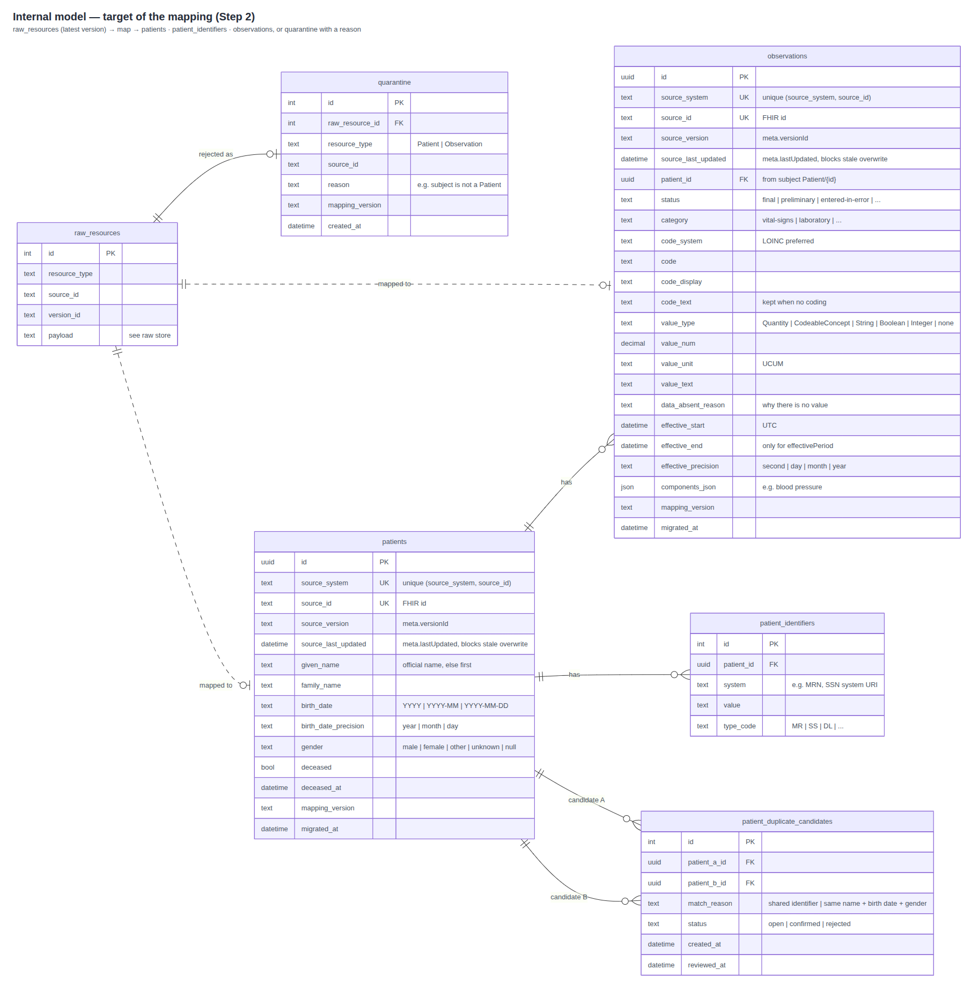

# Plan

## Overall approach

- **Discovery (manual, one-time, already done).** We explored https://hapi.fhir.org/baseR4 to check the FHIR version, supported operations, limits and data quality (Used AI for this discovery).
  - Server: `/metadata` confirms FHIR 4.0.1 (R4) and support for `$export`, `_summary=count` and `_history`.
  - Decision: extract with `$export` only, since the server supports it. A paged-search fallback (`_count=500`, `_lastUpdated` windows) for servers without `$export` is not part of the MVP; it is a next step.
- **Extract with `$export`.**
  - **Kick-off**: `GET $export?_type=Patient,Observation` with `Prefer: respond-async`. The server answers `202` with a `Content-Location` header, which is the job's status URL. Any other answer (`404/405/501`, `401/403`) fails fast with a clear error.
  - **Poll**: call the status URL. `202` means still running (wait for `Retry-After`); `200` returns the manifest with `transactionTime` and the list of NDJSON file URLs.
  - **Expected counts**: right after the manifest arrives, query `_lastUpdated=le<transactionTime>&_summary=count` per resource type and store the result for reconciliation.
  - **Download**: fetch every file with a small worker pool (3, configurable), retrying `429/5xx`/timeouts with exponential backoff and jitter.
  - **Store raw**: save each NDJSON line as-is in the raw store, deduplicated by `(resource_type, source_id, version_id)`. Each file is marked done in the same transaction.
- **Raw store:** Before any transformation, the export lands in three tables that record exactly what the source returned and how far the extraction got. Nothing is mapped or filtered here. This is what makes the extraction resumable and lets us reprocess without calling the legacy API again.

  

  - How the tables are filled (run → job → N files → raw rows)
- **Failure handling**: Transient errors are retried with backoff, permanent errors fail fast, failed files are retried on the next run, and a crash at any point is recovered by simply running again; when a cap is reached, the run stops and alerts a human.

  

- **API limits**. The legacy API is a shared clinical system, so we stay conservative:
  - Small worker pool: 3 parallel downloads (configurable). During discovery, latency doubled under 10 concurrent requests, so adding more workers adds load without adding speed.
  - Max page size: if the paged-search fallback is added, it should use `_count=500`, the server's maximum, to keep requests to a minimum.
  - Server signals first: we honour `Retry-After` and back off on `429/5xx`.
  - Estimate: 50k patients means ~480 files of 1,000 resources each, under 10 minutes to download with 3 workers.
  - Circuit breaker: after 10 consecutive failures across different requests (the counter resets on any success), all workers stop and the run ends with an `ERROR` log, instead of each file retrying against a server that is down.
- **Observability**. Every step writes one structured JSON log line, such as kick-off, file done, retry or failure.
  - What each line includes: `job_id`, `file_id`, `attempt`, `http_status`, duration and line counts.
  - What it never includes: payloads, names, birth dates or clinical values, only technical IDs and numbers.
  - Logs vs tables: the logs show what happened and when, and the tables show where things stand now.
  - End-of-run summary: files done and failed, and lines per type compared with the expected counts.
- **Resumability:** The migration can stop at any point and be safely run again. Before moving on, every step saves its progress in the tables. A new run therefore resumes the same export job through the saved `poll_url` and downloads only the files not yet marked done. Transform and load read only from the raw store, so they can be re-run without calling the API again. Unique keys make every re-run idempotent, which means running twice gives the same result as running once.
- **Out of scope**:
  - Merging duplicate patients and reviewing quarantined records: both are reported for information only (counts and reasons in the run report).
  - Delete detection: `$export` does not report deleted resources. The MVP runs a single full export, so there is nothing to compare. Next step: detect deletes via `_history?_since=<transactionTime>` before the final cutover.

## Data mapping



- **Principle:** preserve, don't infer. Missing stays null, units are never converted, and dates never gain precision they didn't have.
- **Quarantine**: unusable records are kept aside with the reason, so nothing is lost silently.
- **Deduplication**:
  - Technical: one FHIR Patient → one row; versions never go backwards.
  - Identity: not automated, since merging the wrong patients is a clinical risk. Potential duplicates (shared identifier, or same name + birth date + gender) are written to a *patient_duplicate_candidates* table for human review; confirmed cases are fixed at the source, never by deleting records.
- **Not migrated**: phone, address and other demographic fields (data minimisation; they remain in the raw store).

## Validation

```
export_lines(Patient)          == _summary=count at transactionTime
export_lines(Observation)      == _summary=count at transactionTime
loaded + quarantined           == extracted
duplicate_records              == 0
observations_without_patient   == 0
files_pending_or_failed        == 0
sample_mismatches (1% sample)  == 0
```

## Safety (PHI in a real version)

Minimum data: export and migrate only what the service needs. Protected storage: raw store, quarantine and backups are encrypted, access-controlled, and the raw store is purged after acceptance. No PHI in logs: only technical IDs and counts. Synthetic data only outside production: this exercise uses synthetic data, read-only.

## Rollback

The legacy system is never written to, so it is always the way back. Data is loaded into a separate candidate database that nobody uses until validation passes. If something fails just discard candidate database, fix and run again.

## MVP scope

- Backend – Django 5.2 LTS
- Frontend – Vue 3 + Vite
- Database – SQLite
