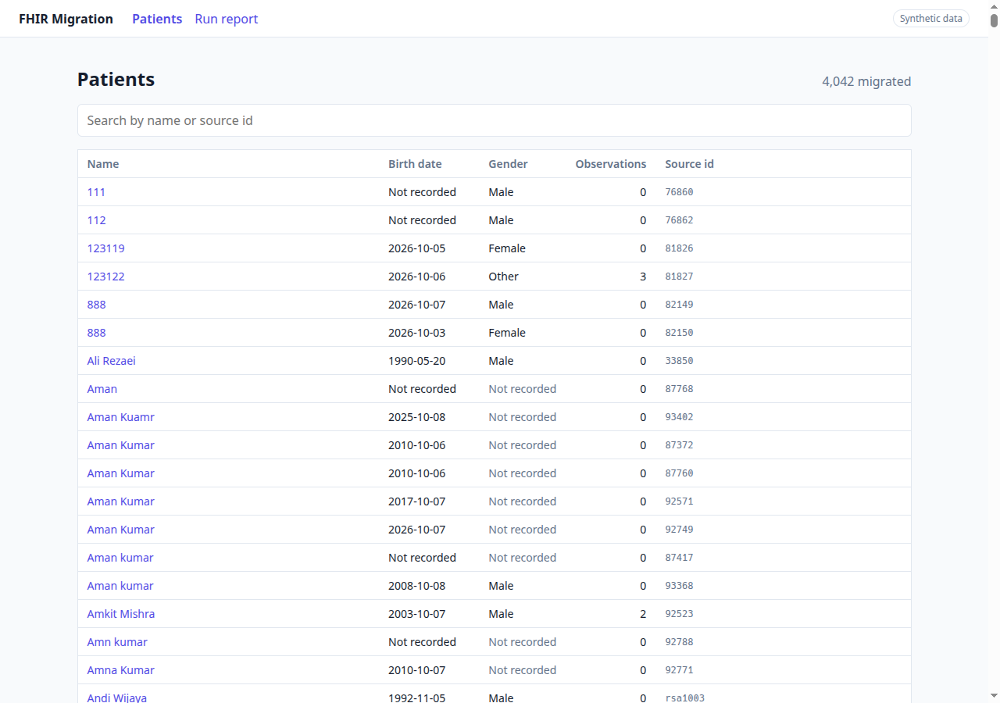
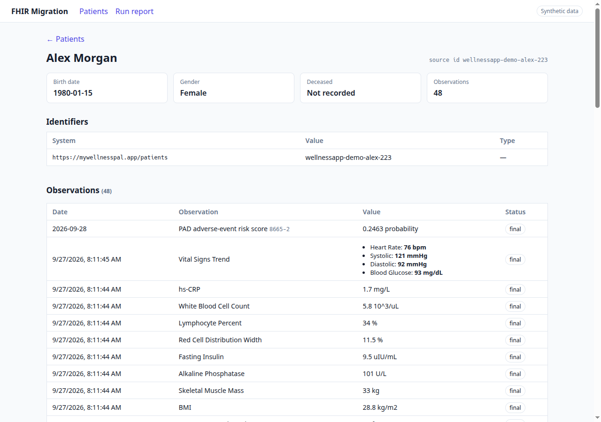
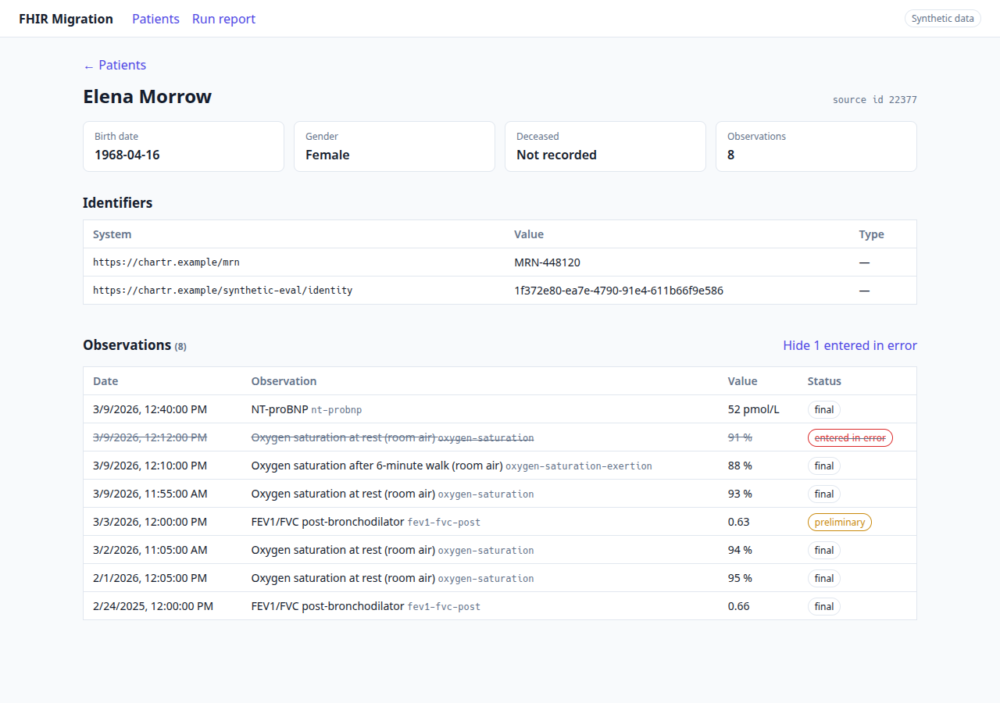
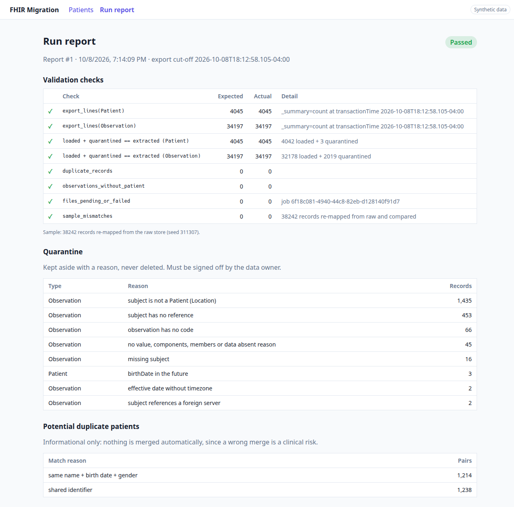

# FHIR Migration MVP

Extracts patients and observations from a FHIR (Fast Healthcare Interoperability Resources) R4 server, maps them into a simpler internal model, validates the result, and shows it in a small web UI. This is an MVP (Minimum Viable Product).

> **Synthetic data only.** Everything here runs against the public HAPI test server (`https://hapi.fhir.org/baseR4`), read-only, into a disposable local database. No real patient data is used or stored.

- **Plan:** [Plan.md](Plan.md) covers the approach, mapping, validation, safety and rollback.

## Repository layout

```
app/
  backend/     Django 5.2 LTS (async) · Python 3.14 · SQLite
    pipeline/    extract → raw store → transform → validate (services + migrate_fhir command)
    clinical/    internal model (Patient, Observation…) + async JSON API
  frontend/    Vue 3 + Vite · Node 24 LTS
docs/          diagrams, screenshots
```

## Quick start

**Prerequisites:**
- [uv](https://docs.astral.sh/uv/), which installs Python 3.14 automatically from `.python-version`;
- Node 24 LTS (`nvm use` reads `app/frontend/.nvmrc`).

**One command for the backend:** `first_start.sh` installs the dependencies, creates the database and runs extract, transform and validate. It stops at the first failing step.

```bash
./first_start.sh            # first run
./first_start.sh --reset    # delete the local database and start from scratch
```

Then start the API and the frontend (steps 1 and 2 below, from `uvicorn` and `cd app/frontend`).

**Step by step:**

```bash
# 1. Backend: install, create the database, run the pipeline
cd app/backend
uv sync
uv run python manage.py migrate
uv run python manage.py migrate_fhir extract      # $export from HAPI → raw store (~1.5 min)
uv run python manage.py migrate_fhir transform    # raw store → internal model (~6 s)
uv run python manage.py migrate_fhir validate     # checklist + run report
uv run uvicorn config.asgi:application --port 8010

# 2. Frontend (second terminal)
cd app/frontend
nvm use && npm install
npm run dev                                        # http://localhost:5173
```

### Pipeline commands

| Command | What it does |
|---|---|
| `migrate_fhir extract [--workers N]` | Starts the `$export` kick-off (or resumes the unfinished job), polls the job, stores the expected counts and downloads every NDJSON (Newline Delimited JSON) file into the raw store, `--workers` at a time (default 3). Safe to re-run. |
| `migrate_fhir transform [--rebuild]` | Maps the latest version of each raw resource into the internal model, or into quarantine with a reason. `--rebuild` clears the internal model first (the MVP rollback). |
| `migrate_fhir validate [--sample-rate 0.01] [--seed N]` | Runs the acceptance checklist and stores a `RunReport`; exits with code 1 if any check fails. `--sample-rate` is the share of records re-mapped from the raw store and compared field by field with the database (`0.01` = 1%, `1.0` = all). `--seed` fixes which records are sampled (see below). |

**Sample and seed.** By default each `validate` run samples different records. The seed decides which ones: with the same data and the same `--sample-rate`, the same seed always picks the same records. Every report prints and saves the seed it used, so a failed run can be repeated on exactly the same records after a fix:

```bash
uv run python manage.py migrate_fhir validate
# ...
# Report 3: FAILED (sample seed 311307)

# fix the mapping, transform again, then re-check the same records
uv run python manage.py migrate_fhir validate --seed 311307
```

Every pipeline step also writes one JSON line per event to `app/backend/logs/migration.log` (appended across runs, git-ignored, no PHI (Protected Health Information): only technical IDs and counts).

### Configuration

Environment variables (all optional):

| Variable | Default | What it controls |
|---|---|---|
| `FHIR_BASE_URL` | `https://hapi.fhir.org/baseR4` | Source FHIR server; links to any other host are rejected |
| `EXPORT_WORKERS` | `3` | Parallel file downloads (`--workers` overrides it) |
| `EXPORT_POLL_MAX_WAIT` | `10` | Maximum seconds between polls of the `$export` job |
| `DJANGO_SECRET_KEY` | `dev-only-insecure-key` | Django secret key; must be set outside local use |
| `DJANGO_DEBUG` | `1` | Django debug mode; set to `0` outside local use |

Fixed settings in [settings.py](app/backend/config/settings.py):

| Setting | Value | What it controls |
|---|---|---|
| `HTTP_TIMEOUT_SECONDS` | `20` | Timeout per HTTP request |
| `RETRY_MAX_ATTEMPTS` | `5` | Attempts per request for `429`, `5xx` and timeouts |
| `RETRY_MAX_BACKOFF_SECONDS` | `30` | Maximum wait between attempts (exponential backoff plus jitter) |
| `CIRCUIT_BREAKER_THRESHOLD` | `10` | Consecutive failures that stop all workers |
| `FILE_MAX_RUNS` | `3` | Runs a failed file is retried before the migration halts |
| `TRANSFORM_BATCH_SIZE` | `1000` | Resources mapped and written per transaction |
| `MAPPING_VERSION` | `4` | Bumped when the mapping changes, so the next transform re-maps everything |

### API

Read-only JSON API under `/api/`. Every error returns JSON (`{"error": "..."}`).

| Endpoint | Returns |
|---|---|
| `GET /api/health` | `{"status": "ok"}` |
| `GET /api/patients?q=` | `{"count", "results"}` with every patient and its observation count. `q` searches by name or exact source id. |
| `GET /api/patients/{id}` | One patient with its identifiers; `404` if unknown |
| `GET /api/patients/{id}/observations?include_errors=1` | `{"count", "results", "entered_in_error"}`, newest first. Observations marked `entered-in-error` are hidden unless `include_errors=1`; `entered_in_error` says how many were hidden. `404` if the patient is unknown. |
| `GET /api/runs/latest` | The latest validation report; `404` if `validate` has not run yet |

`{id}` is the internal UUID, not the FHIR id. Unknown paths and invalid ids return `404`; any method other than `GET` returns `405`.

### Run tests

```bash
cd app/backend && uv run python manage.py test     # 66 tests, no network needed
```

## Results against the live server

Measured on 2026-10-08. The server is shared and changes during the day.

| Step | Result |
|---|---|
| Extract | 40 NDJSON files (5 Patient, 35 Observation), **38,242 resources**: 22 s for the server to prepare the export, 73 s to download; lines match `_summary=count` at `transactionTime` exactly |
| Re-run of extract | New export, **0 inserted, 38,242 duplicates skipped** |
| Transform | **4,042 patients + 32,178 observations** loaded in 6 s; 3 + 2,019 quarantined; re-run reports everything `unchanged` |
| Validate | 8/8 checks pass; with `--sample-rate 1.0`, **all 38,242 records re-mapped from raw and compared, 0 mismatches** |

Top quarantine reasons, all found earlier during discovery:

| Reason | Records |
|---|---|
| subject is not a Patient (Location) | 1,435 |
| subject has no reference | 453 |
| observation has no code | 66 |
| no value, components, members or data absent reason | 45 |

## How it works

```
FHIR $export ──▶ raw store ──▶ transform ──▶ internal model ──▶ async API ──▶ Vue UI
   (NDJSON)      (untouched)   (pure mappers)  (or quarantine)
                      ▲                              │
                      └──────── validate (counts + re-mapped sample) ◀┘
```

**Extract** ([extract.py](app/backend/pipeline/services/extract.py), [fhir_client.py](app/backend/pipeline/services/fhir_client.py)):
- **Job state is the cursor:** `poll_url`, `transactionTime` and per-file status are saved, so a crash resumes the same export.
- **Retries:** retries with exponential backoff and jitter, honouring `Retry-After`.
- **Fail fast:** permanent errors (`4xx`, `$export` unsupported) stop at once with a clear hint.
- **Circuit breaker:** stops all workers after 10 consecutive failures.
- **Origin check:** links pointing to another host are rejected.
- **One transaction per file:** a partial download never counts. The unique key `(resource_type, source_id, version_id)` makes re-runs idempotent.
- **Diagrams:** [raw store](docs/raw-store-erd.png) · [retry flow](docs/retry-flow.png)

**Transform** ([transform.py](app/backend/pipeline/services/transform.py), [mapping.py](app/backend/pipeline/services/mapping.py)):
- **`PatientMapper` / `ObservationMapper`** are pure classes: they take FHIR JSON and return a record or `Rejected(reason)`.
- **Upserts:** `TransformEngine` upserts in batches of 1,000. Unchanged versions are skipped, an older version never overwrites a newer one, and a `MAPPING_VERSION` change re-maps everything.
- **Duplicate patients** are only *reported*, never merged automatically, since a wrong merge is a clinical safety risk.
- **Diagram:** [internal model](docs/internal-model-erd.png)

**Validate** ([validate.py](app/backend/pipeline/services/validate.py)):
- **Counts:** compares source counts with export lines, and checks that loaded + quarantined equals extracted.
- **Integrity:** no duplicates, no orphan observations, no pending files.
- **Sample:** re-maps a sample from the raw store and compares it field by field with the database.
- **It caught a real bug** during development: decimals with more than 10 places were being rounded silently (5,044 values). Values are now kept exactly as text (`value_text`), with a numeric copy for sorting.

### Mapping decisions

The principle is to preserve, not infer. A missing field stays `null`, units are never converted, and dates never gain precision they didn't have.

- **Name:** the `official` name, else the first one, else `name.text`.
- **Identifiers:** all of them, in a child table, since there is no common MRN (Medical Record Number).
- **`birthDate`:** stored with its precision (`year` / `month` / `day`). Values with a time are truncated; future dates go to quarantine.
- **`deceasedDateTime`:** converted to UTC (Coordinated Universal Time) and stored with its precision, so `2020` stays a year and is not shown as `2020-01-01`.
- **`gender`:** missing stays `null`, not `unknown`.
- **`subject`:** only `Patient/{id}` of a loaded patient; anything else goes to quarantine.
- **`code`:** LOINC (Logical Observation Identifiers Names and Codes) preferred; `code.text` is kept when there is no coding.
- **`value[x]`:** the 5 types that actually occur (Quantity, CodeableConcept, string, boolean, integer). Any other type goes to quarantine.
- **`component[]`:** kept as JSON.
- **`effective[x]`:** converted to UTC. Date-only values keep `day` precision, and no time is invented.
- **Times without a timezone** (invalid in FHIR) go to quarantine instead of being assumed UTC; 2 observations in the current data.
- **A record that becomes invalid** (new version or new mapping) leaves the internal model and goes to quarantine, so it is never counted twice.
- **`entered-in-error`:** loaded, but hidden by default in the UI.
- **Not migrated (data minimisation):** phone, address and other demographics. They remain in the raw store.

## Screenshots

| Patients | Patient detail |
|---|---|
|  |  |
| **Entered-in-error shown on demand** | **Run report** |
|  |  |

## How I used AI

I used **Claude Code** (Anthropic) as a pair programmer throughout this exercise, and **ChatGPT** (OpenAI) as a second, independent opinion to validate the results.

| Area | How AI was used | What I did |
|---|---|---|
| API discovery | Ran read-only requests against the HAPI sandbox (`/metadata`, `$export`, `_summary=count`, page-size limits) and profiled the synthetic data quality | Reproduced the key calls myself in Postman (kick-off, poll, expected counts) and chose `$export` as the extraction strategy |
| Plan (Part 1) | Refined my suggestions into clearer text and explained concepts I asked about (bulk export, backoff, circuit breaker, cutover) | Proposed the approach and the content of each section, chose the structure, cut what I found unnecessary and approved the final [Plan.md](Plan.md) |
| Diagrams | Generated the diagrams in [docs/](docs/) | Asked for simplifications, e.g. removing `last_seen_job_id` and the redundant job link from the raw store |
| Code and tests | Wrote the backend, frontend and tests from my instructions | Chose the stack and the latest LTS versions, asked for class-based services and readable code, kept scope to the brief (no pagination, no auth), and reviewed the result |

**How AI output was checked:**
- every step was run against the live sandbox;
- results were cross-checked with ChatGPT, a different model from the one that wrote the code;
- the test suite runs without network access;
- the validation step re-maps the data from the raw store and compares it with the database. This caught a real decimal-precision bug in the generated code, which was then fixed.

## Known limitations (MVP)

- **SQLite:**
  - `value_num` keeps about 15 significant digits; `value_text` holds the exact value.
  - Writes go through a single connection.
  - Large `IN` queries are batched to stay under SQLite's parameter limit.
- **Deletes:** not detected, because the MVP runs a single full export and HAPI's manifest has no `deleted` list.
- **Paged-search fallback:** not implemented; the extractor only supports `$export`. It is listed as a next step.
- **Expected-count differences** are reported, but not explained automatically through `_history`.
- **No authentication, encryption at rest or raw-store purge:** this is a local demo on synthetic data. `requiresAccessToken` is ignored because the public server does not enforce it.
- **Quarantine sign-off and duplicate review** are informational only, with no workflow.
- **No pagination**, which the brief puts out of scope. The list returns all 4,042 patients in ~65 ms, and the largest patient's 5,931 observations in ~140 ms. At 50k patients, cursor-based pagination would be the first thing to add.
- **No frontend tests;** the UI was checked manually in the browser.

## What I'd do next (version 2)

Ordered by risk: first what affects whether the data is right, can be recovered and can be reproduced; infrastructure comes after.

### 1. Correctness

- **Deletes:** detect them through `_history?_since=<transactionTime>`, and explain count differences automatically.
- **Integrity alert** when the same `versionId` arrives with different content.
- **Exact decimals:** Postgres `NUMERIC` instead of SQLite, so `value_num` stops losing precision beyond ~15 digits.

### 2. Recovery

- **Paged-search fallback** (`_lastUpdated` windows, `_count=500`) for servers without `$export`.
- **A candidate database plus an atomic switch** for the real cutover (described in the plan's Rollback section).
- **Cutover tooling:** a write freeze on the legacy system, a final delta, ID reconciliation, then the switch.

### 3. Reproducibility

- **A small versioned synthetic dataset,** so the pipeline and the UI can be run and checked without depending on the public server.
- **CI** running the tests, linting and type checks on every change.

### 4. Background processing with Celery + RabbitMQ

Today each step is a management command run by hand. In v2 the pipeline becomes a set of background tasks:

```
Celery Beat ──▶ start_export ──▶ poll_export ──▶ download_file × N ──▶ transform_batch × N ──▶ validate
 (schedule)       (kick-off)     (countdown =     (one task per        (one task per           (chord callback)
                                  Retry-After)     NDJSON file)          1,000 resources)
```

- **Units of work:** one task per NDJSON file and per transform batch. Both are already idempotent, so `acks_late=True` is safe: if a worker dies, RabbitMQ redelivers the task and the unique keys prevent duplicates.
- **Retries:** `autoretry_for` with `retry_backoff` and `retry_jitter` replaces the hand-written retry loop. A task-level `rate_limit` protects the legacy API.
- **RabbitMQ rather than Redis as the broker:** durable queues, explicit acks and redelivery, plus a **dead-letter exchange** for files that keep failing.
- **Separate queues** (`extract`, `transform`, `validate`) scale independently, for example more transform workers than download workers.
- **Celery Beat** schedules delta exports (`_since=<last transactionTime>`) until the cutover.
- **Flower,** or metrics exported from Celery, shows queue depth, failures and throughput.

An alternative that keeps fewer moving parts is Django's built-in Tasks framework with a production backend, but Celery + RabbitMQ is the more proven choice at this scale.

### 5. Storage and scale

- **Pagination:** cursor-based pagination on the patient list and the observations endpoint.
- **Postgres for scale:**
  - `JSONB` for the raw payload;
  - concurrent writers;
  - `COPY` for bulk loads;
  - table partitioning for millions of observations.
- **NDJSON files streamed to object storage (S3)** and parsed line by line, instead of loaded into memory.

### 6. Workflows for people

- **Quarantine review:** fix at the source, adjust the mapping, or accept the loss, with sign-off.
- **Duplicate review:** confirm or reject candidates, integrated with the hospital's MPI (Master Patient Index) process.

### 7. Security and operations

- **Authentication and access:**
  - SMART (Substitutable Medical Applications, Reusable Technologies) Backend Services, using OAuth client credentials, for `$export`;
  - SSO (Single Sign-On) with role-based access on the UI;
  - an audit log of who viewed what.
- **Data protection:** encryption at rest, the raw store purged after acceptance (TTL, time to live), and secrets kept in a vault.
- **Monitoring:** Prometheus/Grafana dashboards, an alert on `migration_halted`, and OpenTelemetry tracing.
- **Delivery:**
  - Docker Compose (Django, worker, RabbitMQ, Postgres, frontend);
  - frontend tests (Vitest + Playwright).
